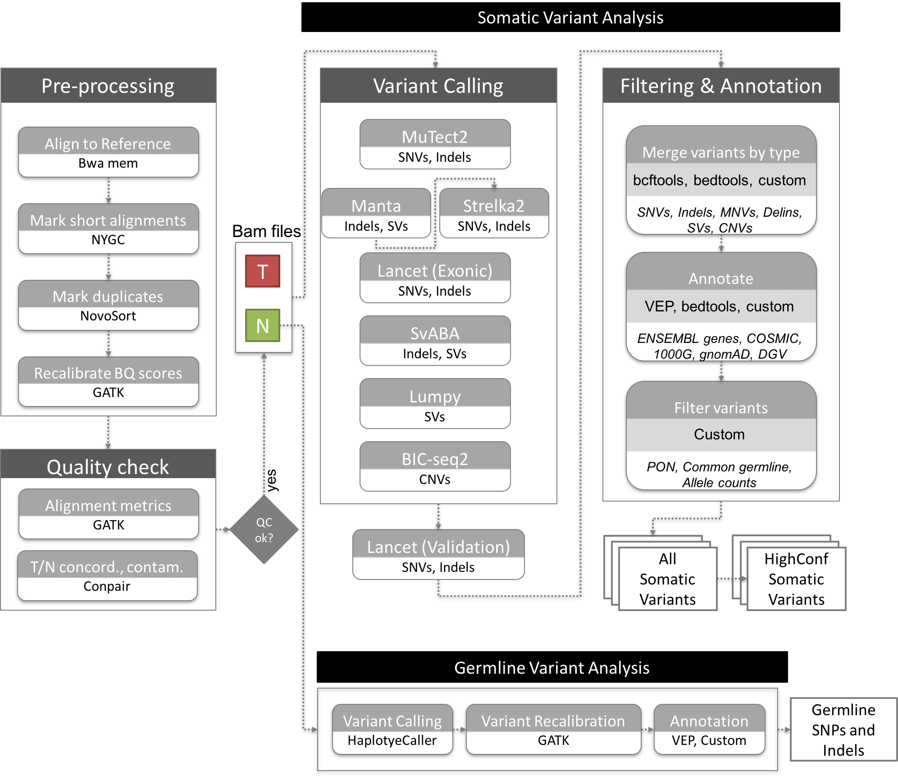

# NYGC Cancer Pipeline

NYGC’s cancer pipeline identifies somatic and germline variants from whole genome sequencing (WGS), whole exome sequencing (WES) or targeted panel tumor and normal data. The pipeline can be run on sequencing data from human, mouse and patient-derived xenograft (PDX) models.

Additionally, it can detect microsatellite instability (MSI) and identify mutational signatures within the tumor sample, and predict human leukocyte antigen (HLA) genotypes from the normal sample data.

## Pipeline Documentation:

- [SomaticPipeline_v6.0_Human_WGS](SomaticPipeline_v6.0_Human_WGS.pdf)
- [SomaticPipeline_v6.0_Human_Exome](SomaticPipeline_v6.0_Human_Exome.pdf)
- [SomaticPipeline_v5B.3](CancerAnalysisforexternalusersv5.pdf)

Related Publication:
Arora, K., Shah, M., Johnson, M., Sanghvi, R., Shelton, J., Nagulapalli, K., … Robine, N. (2019). Deep whole-genome sequencing of 3 cancer cell lines on 2 sequencing platforms. Scientific reports, 9(1), 19123. [doi:10.1038/s41598-019-55636-3](doi:10.1038/s41598-019-55636-3).

Variant calls and additional information available on our companion website.

### Contributors:
Nicolas Robine  
Minita Shah  
Tim Chu  
Jennifer Shelton  

# 3 Cancer Cell lines on 2 sequencers

This website is intended to be a companion to the paper published in Scientific Reports, to host some important files (also accessible elsewhere) and present additional figures and reports.

Publication
The paper is now available in [Scientific Reports](https://www.nature.com/articles/s41598-019-55636-3)

Data availability
The raw data is available on dbGAP.

The somatic variant files, obtained from the high-coverage data are accessible below (or directly in Variants.HighCoverage.tar.gz 140MB):

## Data availability
The raw data is available on [dbGAP](https://dbgap.ncbi.nlm.nih.gov/beta/study/phs001839.v1.p1/#study).

The somatic variant files, obtained from the high-coverage data are accessible directly in [Variants.HighCoverage.tar.gz](data/Variants.HighCoverage.tar.gz) (140MB):

 

| Cell line	| SNV/indel |	CNV	| SV	| SV high confidence | 
| --------- | -------- | --- | ----- | ------------------ |
| COLO-829 (HiSeqX) | VCF	| BED	| bedpe	| bedpe |
| COLO-829 (NovaSeq)	| VCF	| BED	| bedpe	| bedpe | 
| HCC-1143 (HiSeqX)	| VCF	| BED	| bedpe	| bedpe |
| HCC-1143 (NovaSeq)	| VCF	| BED	| bedpe	| bedpe |
| HCC-1187 (HiSeqX)	| VCF	| BED	| bedpe	| bedpe |
| HCC-1187 (NovaSeq)	| VCF	| BED	| bedpe	| bedpe |
 

The somatic variant files obtained from downsampled 40X/80X coverage are accessible below (or directly in Variants.Downsampled.tar.gz 89MB):

 

| Cell line	| SNV/indel	| CNV	| SV	| SV high confidence |
| --------- | -------- | --- | ----- | ------------------ |
| COLO-829 (HiSeqX)	| VCF	| BED	| bedpe	| bedpe |
| COLO-829 (NovaSeq)	| VCF	| BED	| bedpe	| bedpe |
| HCC-1143 (HiSeqX)	| VCF	| BED	| bedpe	| bedpe |
| HCC-1143 (NovaSeq)	| VCF	| BED	| bedpe	| bedpe |
| HCC-1187 (HiSeqX)	| VCF	| BED	| bedpe	| bedpe |
| HCC-1187 (NovaSeq)	| VCF	| BED	| bedpe	| bedpe |

## Sample reports
Reports summarizing the results of our pipeline for each tumor-normal pair:

| Cell line	| Report |
| --------- | -------- |
| COLO-829 (HiSeqX)	| HTML |
| COLO-829 (NovaSeq)	| HTML |
| HCC-1143 (HiSeqX)	| HTML |
| HCC-1143 (NovaSeq)	| HTML |
| HCC-1187 (HiSeqX)	| HTML |
| HCC-1187 (NovaSeq)	| HTML |

Related work
Related to the deep sequencing of cancer cell lines in HiSeqX and NovaSeq, we tested the new kit for NovaSeq, producing 2x250bp reads. We sequenced HCC-1143 (and matched normal HCC-1143-BL) and the well-characterized CEU HapMap trio (NA12878, NA12891, and NA12892).

The poster will be presented at CSHL Biology of Genomes conference on Friday, May 9th 2019 by Minita Shah and Molly Johnson and is accessible below.

[Germline and somatic variant calling with NovaSeqTM 6000 2x250bp reads](BOG-poster-20194.pdf)

Authors: Minita Shah, Marta Byrska-Bishop, Wayne E. Clarke, Molly Johnson, Kanika Arora, Rashesh Sanghvi, Uday Evani, Kshithija Nagulapalli, Michael C. Zody, Soren Germer, Jade Carter, Giuseppe Narzisi, Nicolas Robine
